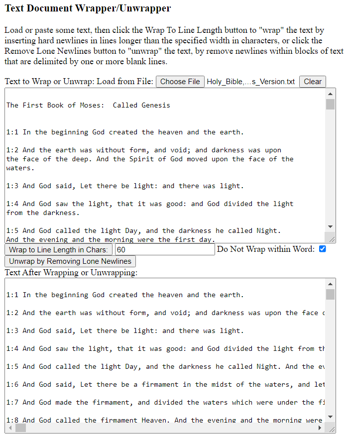

TextUnwrapper
=============

A utility to remove hard newlines within "paragraphs" in a text document.  For purposes of this program, a paragraph is defined as a passage of text delimited by multiple contiguous newlines, that is to say, by blank lines.

